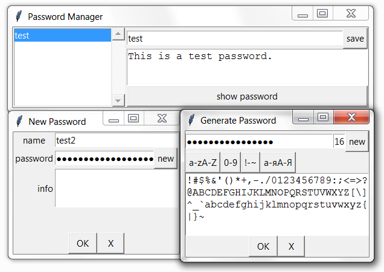

Password Manager
================

About
-----

This is a manager for passwords which runs under [Python 3](https://www.python.org/downloads/) and in the browser.

The Python version is able to add passwords and remove them. The [webbrowser version](http://rawgit.com/niccokunzmann/PasswordManager/master/manager.html) can only view the passwords.

Use
---

I recommend to [download the manager](https://github.com/niccokunzmann/PasswordManager/archive/master.zip) or clone it.  
[Install Python 3](https://www.python.org/downloads/).  

Make backups by copying the whole folder with the password manager to somewhere.
Future versions may be be incompatible with the format of the passwords.json file. So, do not update the manager directly but download a new version, export and, import the passwords. Do not forget to delete the export file.

You may not always have Python 3 with you. In this case you can use the html/javascript version to view your passwords. You can reach it [here](http://rawgit.com/niccokunzmann/PasswordManager/master/manager.html). It would be good to make your own web version accessible from somewhere.  You can store the password file somewhere in the web where other people do not have access - Dropbox, ownCloud, e-mails - to read it out and copy it to the password manager.

Password Protection
-------------------

The passwords and only the passwords are encrypted using the master password. The master password is hashed twice and that hash is stored in the database to give feedback whether the master password is correctly typed in.  
The descriptions and the names are not encrypted.  
Encrypted passwords are stored in the passwords.json file along with all the other information. 

Random passwords are generated. They include characters which can be typed in with an English keyboard layout.

Web Version
-----------

The web version can be found in the [manager.html](http://rawgit.com/niccokunzmann/PasswordManager/master/manager.html). You, not the file, will need read access to the passwords.json file. You can open it with any text editor and copy the content into the website.  
After you typed in the correct master password you can decrypt the passwords.

Try it out
----------

  
In the picture above, the password for test2 shall be added to the manager using the [passwords.json](./demonstration/passwords.json) file in the [demonstration](./demonstration/) folder.
The password is `password`. [Try out the web version](http://rawgit.com/niccokunzmann/PasswordManager/master/manager.html?load=https%3A%2F%2Fraw.githubusercontent.com%2Fniccokunzmann%2FPasswordManager%2Fmaster%2Fdemonstration%2Fpasswords_viewer.js).

License
-------

MIT, see the [license file](./LICENSE). If this software destroys your passwords it is not my problem. In short: This is a free password manager and you can do with it whatever you like.

Thanks
------

Thanks to all the websites that helped. You can see it in the code. For the README it was

- [https://thecustomizewindows.com/2013/09/opening-webpage-from-github-repo-for-dev-purpose/](https://thecustomizewindows.com/2013/09/opening-webpage-from-github-repo-for-dev-purpose/) to show the [web version](http://rawgit.com/niccokunzmann/PasswordManager/master/manager.html?load=https%3A%2F%2Fraw.githubusercontent.com%2Fniccokunzmann%2FPasswordManager%2Fmaster%2Fdemonstration%2Fpasswords_viewer.js) from the master branch.
